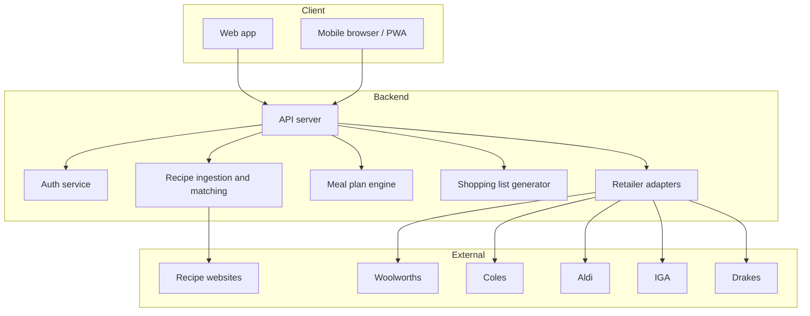

# Recipe to Plate — Development Plan

## 1. Vision and scope

**Goal:** Save time and effort for busy mothers by unifying: family taste profiles → recipe discovery → meal planning → condensed shopping list → **populating the shopping basket on each retail website** using the main user's credentials.

**Primary user:** Main user (e.g. parent) who enters data via **web browser** or **mobile device**.

**Cart population:** The app will populate the shopping basket on each retailer's website (Woolworths, Coles, Aldi, IGA, Drakes) by authenticating as the main user with credentials they provide. The user then completes checkout and payment on the retailer's site. This implies storing and using the main user's retailer login credentials securely; see **Security considerations** below.

**Out of scope for this plan:** Payment processing (handled on retailer sites), actual order placement (user completes checkout on each site).

---

## 2. User flows (high level)

```mermaid
flowchart LR
  subgraph setup [Setup]
    A[Main user login]
    B[Add family members]
    C[Set likes and dislikes]
  end
  subgraph recipes [Recipes]
    D[Select or suggest recipe sources]
    E[Match recipes to family tastes]
    F[Build meal plan for week or fortnight]
  end
  subgraph shop [Shopping]
    G[Condensed shopping list]
    H[Choose retailer(s)]
    I[Load cart via user credentials]
  end
  A --> B --> C --> D --> E --> F --> G --> H --> I
```


- **Setup:** One-off or ongoing — define household, add members, maintain culinary preferences (likes/dislikes, allergens, cuisines).
- **Recipes:** User picks recipe sources (sites) and/or requests suggestions; app matches to family tastes; user (or app) assigns recipes to days → **weekly or fortnightly meal plan**.
- **Shopping:** App condenses recipes into one **shopping list** (ingredients, quantities, optional household items). User selects one or more retailers; app uses stored credentials to **scrape / API** and **load cart** per retailer.

---

## 3. Core features (what to build)


| Area                 | Feature                                         | Notes                                                                                    |
| -------------------- | ----------------------------------------------- | ---------------------------------------------------------------------------------------- |
| **Access**           | Web app + mobile-friendly (responsive or PWA)   | Single codebase preferred for "web or mobile"                                            |
| **Auth**             | Main user account (login/signup)                | Email/password or OAuth; no multi-tenant "families" in v1 if not needed                  |
| **Family**           | Household members with names + culinary profile | Profile = likes, dislikes, dietary rules, allergens (optional)                           |
| **Tastes**           | Structured likes/dislikes per member            | Tags/categories (e.g. "no seafood", "loves pasta") to drive matching                     |
| **Recipe sources**   | User-selected sites + optional suggestions      | Curated list of recipe websites; suggestions = match by taste + maybe nutrition          |
| **Recipe ingestion** | Scrape or API from recipe sites                 | Depends on target sites; consider RSS, sitemaps, or scraping with respect to ToS         |
| **Matching**         | Score/filter recipes by family tastes           | Algorithm: e.g. exclude disliked ingredients, boost liked cuisines                       |
| **Meal plan**        | Weekly or fortnightly calendar                  | Assign recipes to days; drag-and-drop or auto-suggest; timeframe selector                |
| **Shopping list**    | Collate ingredients from selected recipes       | Dedupe, aggregate quantities, optional unit normalisation; export/view by retailer later |
| **Retailer list**    | Woolworths, Coles, Aldi, IGA, Drakes            | All .com.au; each needs product/SKU mapping or search                                    |
| **Credentials**      | Store (encrypted) retailer logins               | User provides; used only for cart loading; consider OAuth if any retailer offers it      |
| **Cart loading**     | Per-retailer: search product, add to cart       | Requires product/SKU discovery (scrape or API) + add-to-cart flow per site               |


---

## 4. Target retailers and "scraping" approach


| Retailer   | Domain            | Notes                                                                                |
| ---------- | ----------------- | ------------------------------------------------------------------------------------ |
| Woolworths | woolworths.com.au | Large catalog; may have APIs or strict bot protection; scraping likely ToS-sensitive |
| Coles      | coles.com.au      | Similar scale; check for developer/partner programs                                  |
| Aldi       | aldi.com.au       | Smaller range; different site structure                                              |
| IGA        | iga.com.au        | May vary by region/store                                                             |
| Drakes     | drakes.com.au     | Smaller chain; less public tech info                                                 |


**Needs per retailer:**

- **Product discovery:** Map "shopping list line" (e.g. "milk 2L") to site-specific product/SKU (search results or category browse).
- **SKU / grocery and household items:** Scrape or call API for product ID, name, size, price (for display), add-to-cart payload.
- **Cart:** Authenticate as user (stored credentials), add items (form POST or API), no payment in our app.

**Important:** Scraping retail sites often violates Terms of Service and can break with layout changes. Plan should include:

- Checking each retailer's ToS and any official APIs or partner programs.
- Prefer official APIs or affiliate/partner feeds over scraping where possible.
- If scraping: modular "adapter" per retailer, rate limiting, and maintenance budget for selector/flow changes.

---

## 5. Technical architecture (suggested)

- **Frontend:** Web app (React, Vue, or similar) with responsive/PWA support so "mobile device" is covered by browser.
- **Backend:** API (e.g. Node, Python, or .NET) for auth, family/tastes CRUD, recipe storage, meal plans, shopping list generation.
- **Recipe pipeline:** Jobs or services to fetch from recipe sources, parse, store, and index for matching.
- **Retailer adapters:** One module per retailer (Woolworths, Coles, Aldi, IGA, Drakes); each encapsulates:
  - Product search / SKU resolution (scrape or API).
  - Session/auth with user credentials (secure storage, e.g. vault or encrypted DB).
  - Add-to-cart (and optionally "get cart" for verification).
- **Credentials:** Encrypt at rest; use only in backend; never expose to frontend; consider per-user consent and clear disclosure.




---

## 6. Data and security

- **Family and tastes:** Stored in app DB; only accessible to authenticated main user.
- **Retailer credentials:** Encrypted (e.g. AES with key in env/vault); optional: allow user to "disconnect" or rotate.
- **Scraping:** No storage of full retailer HTML; only product IDs, names, and cart-related payloads as needed; comply with privacy and data minimisation.

---

## 6a. Security considerations (retail credentials and basket population)

Because the app stores and uses the main user's credentials to log in to retail sites and populate their shopping basket, the following security measures must be designed in from the start.

**Credential storage and handling**

- **Encryption at rest:** Retailer usernames/passwords (or tokens) must be encrypted before storage (e.g. AES-256) with a key managed separately from the database (env var, secrets manager, or vault). Never store plaintext retailer passwords.
- **Encryption in transit:** All communication with the backend and with retailer sites must use TLS (HTTPS). Credentials must never be sent to the frontend; only the backend performs login and cart actions.
- **Minimal exposure:** Backend should decrypt credentials only when needed for a cart run, use them in memory only for the session, and avoid logging or persisting them in any readable form.
- **Isolation:** Credentials must be scoped strictly to the main user account; no cross-user access or sharing of retailer logins.

**Access control and consent**

- **Explicit consent:** Before storing retailer credentials, the user must give clear consent (e.g. "I allow Recipe to Plate to log in to [Retailer] and add items to my cart on my behalf") and be informed that their retailer password is stored encrypted.
- **Revocation:** Users must be able to remove or "disconnect" a retailer at any time, which deletes or irreversibly deletes the stored credentials for that retailer.
- **Least privilege:** The app uses credentials only to authenticate and add items to the basket; no attempt to read payment methods, change account details, or perform actions beyond cart population.

**Session and operational security**

- **Retailer sessions:** Use short-lived, scoped sessions when logging in to a retailer (e.g. create session, add items, then allow session to expire). Do not keep long-lived retailer sessions open.
- **2FA / step-up auth:** If a retailer requires 2FA or email/SMS verification, the app cannot complete login without user interaction. Plan for: (a) detecting 2FA prompts, and (b) either pausing and prompting the user (e.g. "Complete login in the retailer's page") or clearly documenting that 2FA-protected accounts may need manual cart completion.
- **Rate limiting and abuse:** Limit how often cart population can be triggered per user per retailer (e.g. to avoid abuse or triggering retailer anti-bot measures). Log attempts and failures for security review, without logging credentials.

**Audit and compliance**

- **No credential logging:** Ensure credentials and session tokens for retailers are never written to application logs, error reports, or analytics.
- **Audit trail:** Consider logging high-level events (e.g. "cart population requested for Retailer X", "cart population succeeded/failed") with user ID and timestamp for support and security review, without any secrets.
- **Privacy and disclosure:** Privacy policy and terms must disclose that retailer credentials are stored and used to populate baskets, how long they are kept, and how users can delete them. Comply with applicable privacy law (e.g. Australian Privacy Act) for handling of third-party account credentials.

---

## 7. Phased implementation (suggested)

**Phase 1 — Foundation**

- Project repo, frontend and backend skeletons.
- Main user auth (web).
- Family members and culinary profiles (likes/dislikes) CRUD.
- Basic UI for "web or mobile" (responsive).

**Phase 2 — Recipes and meal plan**

- Recipe source configuration (user-selected sites).
- Recipe ingestion (one or two pilot sites; scraping or RSS/API).
- Taste-based matching and suggestion.
- Meal plan: weekly/fortnightly view, assign recipes, persist plan.

**Phase 3 — Shopping list**

- Collate ingredients from selected meal plan recipes.
- Dedupe and aggregate quantities; optional unit conversion.
- Shopping list UI and export (e.g. PDF/print or copy).

**Phase 4 — Retailer integration (per retailer)**

- Design adapter interface (product search, add-to-cart).
- Secure credential storage and consent UX.
- Implement one retailer first (e.g. Woolworths or Coles) end-to-end: search product → add to cart.
- Replicate pattern for Aldi, IGA, Drakes; document ToS/API status per retailer.

**Phase 5 — Polish**

- PWA/offline if needed; performance; error handling and retries for cart loading.
- Maintenance runbooks for scraper/selector changes.

---

## 8. Risks and decisions to lock in later

- **ToS and legality:** Formal check for each recipe source and each grocery site; decision on "scrape vs API" and user disclaimer.
- **Credential risk:** User accepts that we use their retailer logins only to populate baskets (see **6a. Security considerations**); 2FA handling may require user to complete login on retailer site when prompted.
- **Scope creep:** Keep "suggestions" and "auto meal plan" simple in v1; iterate based on feedback.
- **Technology stack:** Choose stack (e.g. React + Node, or Vue + Python) and document in repo before Phase 1 implementation.

---

## 9. Deliverable for "build on top"

This plan should live in the repo as a **markdown file** (e.g. `docs/DEVELOPMENT_PLAN.md` or `PLAN.md`) so you can:

- Add sections (e.g. detailed user stories, API specs, DB schema).
- Tick off phases and features.
- Append retailer-specific notes (URLs, selectors, ToS links) as you research.

Next step after you're happy with the plan: create that file in the repo and then start Phase 1 (project setup, auth, family/tastes) with no retailer scraping until the foundation is solid.
